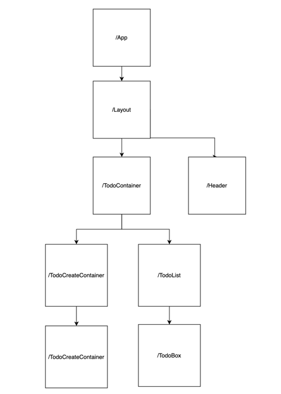

# useState와 props를 사용하여 투두리스트 앱 개발
## `소개 ` 
중복되는 코드를 컴포넌트화 하고 리액트의 useState와 props를 사용하여 todo를 추가하고 완료와 취소 그리고 삭제할 수 있는 앱 개발  

## `목표`
- 컴포넌트와 리액트 훅 요소(useState)를 다룰 수 있게된다.
- 리액트에서 이벤트를 관리할 수 있다.
- 리액트에서 상태(state)가 무엇인지 확실히 이해한다.

# 2. 컴포넌트 구조

# 3. 기능
## `TODO 추가`  

  

## `TODO 토글`  

  

## `TODO 삭제`  

  

